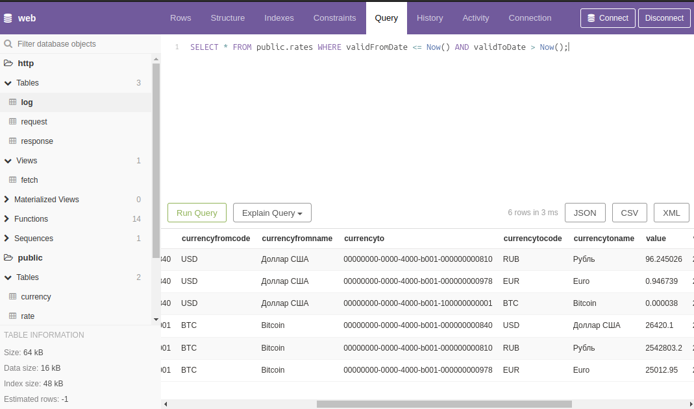

Sending and Processing HTTP Requests in PostgreSQL
=

In this article, I would like to share some developments we use in our projects, specifically how to send and process HTTP requests directly from/to PostgreSQL.

> First off, you will not need to install additional extensions into the database or call functions written in a programming language other than [PL/pgSQL](https://postgrespro.ru/docs/postgresql/16/plpgsql). Furthermore, all requests will be executed asynchronously, and the processing of the received data will be done through callback functions.

## Pgweb

For the demonstration, you will need a pre-configured database, which can be accessed either on our site at <https://apostoldevel.com/pgweb>, or locally by running a **Docker** container.

> Following the [link](https://apostoldevel.com/pgweb) will open [pgweb](https://github.com/sosedoff/pgweb) - a web interface for PostgreSQL. In pgweb, you can execute SQL queries, which will be provided below, as well as explore the contents of tables and the program code of functions written in [PL/pgSQL](https://postgrespro.ru/docs/postgresql/16/plpgsql).


## Docker

Download the Docker image:
```shell
docker pull apostoldevel/apostol
```

Run it:
```shell
docker run -p 8080:8080 -p 8081:8081 -p 5433:5432 --name apostol apostoldevel/apostol
```

Wait for the container to load, and then open pgweb at <http://localhost:8081> in your browser.

Now we have everything we need to make an HTTP request directly from PostgreSQL.

> Instead of pgweb, you can use any other tool for working with databases. PostgreSQL from the container will be available on port 5433.

## HTTP Client

As a first example, let’s make an HTTP request to ourselves (inside the local host):

```sql
SELECT http.fetch('http://localhost:8080/api/v1/time', content => null::text);
```

The execution of the HTTP request will occur **asynchronously**, so instead of the HTTP request data, we will receive a `uuid` identifier.

Outgoing HTTP requests will be recorded in the `http.request` table, and the result of the HTTP request will be saved in the `http.response` table.

To view outgoing HTTP requests and their responses, use the `http.fetch` view:

```sql
SELECT * FROM http.fetch ORDER BY datestart DESC;
```


The `status` field will contain the HTTP response code ([HTTP response status codes](https://developer.mozilla.org/en-US/docs/Web/HTTP/Status)) for our HTTP request, and the `response` field will contain the response.

As the next example, let’s request data from [JSONPlaceholder](https://jsonplaceholder.typicode.com):

```sql
SELECT http.fetch('https://jsonplaceholder.typicode.com/posts/1', 'GET', content => null::text, type => 'curl');
```

And in the `response` field of the `http.fetch` view, we will find:
```json
{
  "userId": 1,
  "id": 1,
  "title": "delectus aut autem",
  "completed": false
}
```

> Here we additionally specified the type `curl`, this parameter is necessary for requests to servers that only support the **HTTP/2** protocol (such requests are executed through the [cURL](https://curl.se) library).

## HTTP Server

Incoming HTTP requests are logged in the `http.log` table:

```sql
SELECT * FROM http.log ORDER BY id DESC;
```


To process incoming HTTP requests, we have two PL/pgSQL functions `http.get` and `http.post` at our disposal.

They accept the following input parameters:

* `path` - Path;
* `headers` - HTTP headers;
* `params` - Query string converted to JSON format;
* `body` - Request body, if it is a POST request.

As a response, the functions return a set ([SETOF](https://postgrespro.ru/docs/postgresql/16/xfunc-sql)) of JSON strings.

> Returning a set of values allows us to work more efficiently with the data, processing each row individually. [Learn more here](https://postgrespro.ru/docs/postgresql/16/plpgsql-control-structures).

Sample code from `http.get`:
```sql
WHEN 'log' THEN
 
    FOR r IN SELECT * FROM http.log ORDER BY id DESC
    LOOP
      RETURN NEXT row_to_json(r);
    END LOOP;
```

You can use the above code like this:
```sql
SELECT http.fetch('http://localhost:8080/api/v1/log', content => null::text);
```

# Callback Functions
-

At the beginning of the article, I mentioned that the processing of received data would be done through callback functions.

To better understand how this will happen, let's solve a specific problem, such as retrieving currency exchange rates with parsing the received response and saving the data in a rate table.

To make it clear how this works in conjunction with an HTTP server, I added the following code to the `http.get` function:
```sql
  WHEN 'latest' THEN

    FOR r IN SELECT * FROM jsonb_to_record(params) AS x(base text, symbols text)
    LOOP
      IF r.base = 'USD' THEN
        RETURN NEXT jsonb_build_object('success', true, 'timestamp', trunc(extract(EPOCH FROM Now())), 'base', r.base, 'date', to_char(Now(), 'YYYY-MM-DD'), 'rates', jsonb_build_object('RUB', 96.245026, 'EUR', 0.946739, 'BTC', 0.000038));
      ELSIF r.base = 'BTC' THEN
        RETURN NEXT jsonb_build_object('success', true, 'timestamp', trunc(extract(EPOCH FROM Now())), 'base', r.base, 'date', to_char(Now(), 'YYYY-MM-DD'), 'rates', jsonb_build_object('RUB', 2542803.2, 'EUR', 25012.95, 'USD', 26420.1));
      ELSE
        RETURN NEXT jsonb_build_object('success', false, jsonb_build_object('code', 400, 'message', format('Base "%s" not supported.', r.base)));
      END IF;
    END LOOP;
```

> On the "latest" query, we will return static data in the format of the [currency exchange rate API](https://exchangeratesapi.io/documentation). If you have access to currency exchange rate services, you can request data through their API.

We will process the received data using the callback function `public.exchange_rate_done`, the source code of which can be reviewed in pgweb, and the queries will be as follows:

From the container:
```sql
SELECT http.fetch('http://localhost:8080/api/v1/latest?base=USD', 'GET', null, null, 'public.exchange_rate_done', 'public.exchange_rate_fail', 'api.exchangerate.host', null, 'latest');
SELECT http.fetch('http://localhost:8080/api/v1/latest?base=BTC', 'GET', null, null, 'public.exchange_rate_done', 'public.exchange_rate_fail', 'api.exchangerate.host', null, 'latest');
```

Through our server:
```sql
SELECT http.fetch('https://apostoldevel.com/api/v1/latest?base=USD', 'GET', null, null, 'public.exchange_rate_done', 'public.exchange_rate_fail', 'api.exchangerate.host', null, 'latest');
SELECT http.fetch('https://apostoldevel.com/api/v1/latest?base=BTC', 'GET', null, null, 'public.exchange_rate_done', 'public.exchange_rate_fail', 'api.exchangerate.host', null, 'latest');
```

Through the currency exchange rate service (if access is available):
```sql
SELECT http.fetch('https://api.exchangerate.host/latest?base=USD&symbols=BTC,EUR,RUB', 'GET', null, null, 'public.exchange_rate_done', 'public.exchange_rate_fail', 'api.exchangerate.host', null, 'latest', null, 'curl');
SELECT http.fetch('https://api.exchangerate.host/latest?base=BTC&symbols=USD,EUR,RUB', 'GET', null, null, 'public.exchange_rate_done', 'public.exchange_rate_fail', 'api.exchangerate.host', null, 'latest', null, 'curl');
```

The result of these actions will be a data-filled `public.rate` table.

You can view the current exchange rates through the `public.rates` view:
```sql
SELECT * FROM public.rates WHERE validFromDate <= Now() AND validToDate > Now();
```



# Asynchronous Notification

Before delving into how it all works in detail, let's refer to the [PostgreSQL documentation](https://postgrespro.ru/docs/postgresql/16/libpq-notify):

> **34.9. Asynchronous Notification**
>
> PostgreSQL provides asynchronous notification via the `LISTEN` and `NOTIFY` commands. A client session registers its interest in a specific notification channel using the `LISTEN` command (and can stop listening using the `UNLISTEN` command). All sessions listening to a specific channel will be notified asynchronously when the `NOTIFY` command is executed with a parameter specifying the name of that channel in any session. A `payload` string can be used to transmit additional data to listening sessions.

As you might have guessed, it is this mechanism that underlies the interaction between PostgreSQL and a certain client application, but let's not get ahead of ourselves.

## In Detail

Let's take a closer look at what happens on the PostgreSQL side after calling the `http.fetch` function:

The PL/pgSQL function `http.fetch` is a wrapper for the `http.create_request` function, where a record is written to the `http.request` table, followed by a call to the `NOTIFY` command through a trigger for adding a new record. That's all there is to it.


Next, a certain client application comes into play, connected to PostgreSQL and ready to receive asynchronous notifications. It acts as an HTTP client and server, sends an HTTP request, and stores the result in the `http.response` table.

## Client Application

The client application is a separate program whose task is to perform certain actions upon signals from the server. In this case, it executes HTTP requests based on the data contained in the `http.request` table.

If you or your team are experienced enough, developing such an application should not be difficult. We use our own open source development — [Apostol](https://github.com/apostoldevel/apostol).


# Conclusion

I have demonstrated a user-friendly yet highly flexible mechanism for communicating with external systems directly from PostgreSQL.

In terms of practical application, imagine that an invoice is generated in your system, which should trigger an automatic debit from the customer's previously linked card. All the necessary data to implement this task are stored in the database. Consequently, the application (microservice) that will interact with the payment system must be connected to the database and somehow notified of the new invoice. The application needs to retrieve the necessary data, process it, form a request to the payment system, and save the result in the database. After a successful debit, an electronic receipt must be generated, which is an interaction with another service, and it would also be nice to notify the client by e-mail, SMS, or through a mobile application ([FCM](https://firebase.google.com/docs/cloud-messaging?hl=ru)) about the invoice and the status of the transaction.

In other words, we get a cascade of tasks for interacting with external systems through their APIs, while operating on the data that is in the database.

So, if the data is in the database, and we have a mechanism for communicating with external systems from PostgreSQL, why not form requests to the APIs of external systems in the same environment where the data is? This is a rhetorical question.

The example above is not a theoretical exposition but a practical and working implementation.

If you need a more visual example, here it is: [Talking to AI](https://t.me/TalkingToAIBot) is a Telegram chatbot for communicating with artificial intelligence (ChatGPT), implemented in PL/pgSQL.

There is an example of a Telegram bot in PL/pgSQL with source code, the link is below.

Source Code Links:
* [Apostol](https://github.com/apostoldevel/apostol)
* [Postgres Fetch](https://github.com/apostoldevel/module-PGFetch)
* [Telegram bot in Postgres](https://github.com/apostoldevel/apostol-pgtg)
