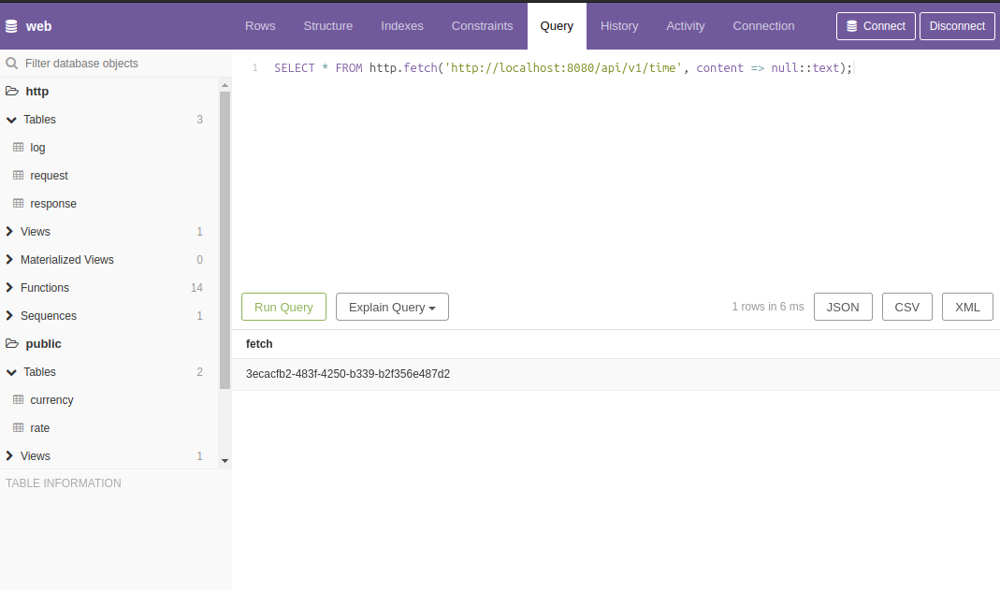

# Sending and Handling HTTP Requests in PostgreSQL Without Extensions or External Languages

In many projects PostgreSQL is used as a “passive” storage: applications query the database for data, and all integration with external APIs is implemented outside of it.

This article shows a different approach: how to send and process HTTP requests directly from PostgreSQL without installing additional extensions and without using external programming languages — only [PL/pgSQL](https://postgrespro.ru/docs/postgresql/16/plpgsql).

At the same time:

- HTTP requests are executed **asynchronously**;
- incoming and outgoing requests are logged in tables;
- responses are processed via **callback functions** in the database itself.

---

## Runtime environment

For the demo we need a preconfigured database. You can access it in two ways:

1. via the web interface on our website: <https://apostoldevel.com/pgweb>
2. locally — by running the environment via Docker Compose (described below).

The link opens [pgweb](https://github.com/sosedoff/pgweb) — a web UI for PostgreSQL. It’s convenient for:

- running SQL queries from this article;
- viewing tables and views;
- exploring PL/pgSQL function code.



---

## Local run via Docker Compose

### Building containers

```bash
./docker-build.sh
```

### Starting containers

```bash
./docker-up.sh
```

After startup:

- **Swagger UI** ([swagger-ui](https://github.com/swagger-api/swagger-ui))  
  is available at:
    - <http://localhost:8080>
    - or `http://<host-ip>:8080`

- **Pgweb** ([pgweb](https://github.com/sosedoff/pgweb)) — web UI for PostgreSQL  
  is available at:
    - <http://localhost:8081/pgweb>
    - or `http://<host-ip>:8081/pgweb`

This is enough to execute HTTP requests directly from PostgreSQL.

> Instead of pgweb you can use any other PostgreSQL client.  
> PostgreSQL from the container is available on port `5433`.

---

## HTTP client in PostgreSQL

Let’s start with the simplest case: perform an HTTP request to a local server.

```sql
SELECT http.fetch('http://localhost:8080/api/v1/time', content => null::text);
```

The request is executed **asynchronously**, so instead of a response you will get a `uuid` — the request identifier.

Under the hood:

- outgoing HTTP requests are saved into the `http.request` table,
- request results — into the `http.response` table.

You can view the history of requests and responses via the `http.fetch` view:

```sql
SELECT * FROM http.fetch ORDER BY datestart DESC;
```


Here:

- `status` — HTTP response code ([HTTP response status codes](https://developer.mozilla.org/en-US/docs/Web/HTTP/Status));
- `response` — HTTP response body.

Now let’s fetch data from the public service [JSONPlaceholder](https://jsonplaceholder.typicode.com):

```sql
SELECT http.fetch(
  'https://jsonplaceholder.typicode.com/posts/1',
  'GET',
  content => null::text,
  type    => 'curl'
);
```

The `response` field will contain something like:

```json
{
  "userId": 1,
  "id": 1,
  "title": "delectus aut autem",
  "completed": false
}
```

> The `type = 'curl'` parameter is used for requests to servers that support only **HTTP/2**. In this case, execution goes through [cURL](https://curl.se).

---

## HTTP server on the PostgreSQL side

Besides outgoing requests, we also record incoming HTTP requests. They are logged in the `http.log` table:

```sql
SELECT * FROM http.log ORDER BY id DESC;
```


Incoming requests are processed by two PL/pgSQL functions:

- `http.get`
- `http.post`

Parameters:

- `path` — request path;
- `headers` — HTTP headers;
- `params` — query string converted to JSON;
- `body` — request body (for POST and similar methods).

The functions return the result as a set of rows (`SETOF json`).

> Returning a set (`SETOF`) allows you to efficiently process results row by row. For details, see the [PL/pgSQL documentation](https://postgrespro.ru/docs/postgresql/16/plpgsql-control-structures).

Here is a fragment of `http.get` that returns the contents of the log:

```sql
WHEN 'log' THEN
 
  FOR r IN SELECT * FROM http.log ORDER BY id DESC
  LOOP
    RETURN NEXT row_to_json(r);
  END LOOP;
```

You can call this code via:

```sql
SELECT http.fetch('http://localhost:8080/api/v1/log', content => null::text);
```

---

## Callback functions: handling responses in the database

Now to the most interesting part. We handle responses via callback functions in the database itself.

Let’s walk through a concrete task: obtain exchange rates, parse the response, and store it in a rates table.

To show how this is connected with the HTTP server, we’ll add `latest` path handling to `http.get`:

```sql
WHEN 'latest' THEN

  FOR r IN
    SELECT * FROM jsonb_to_record(params) AS x(base text, symbols text)
  LOOP
    IF r.base = 'USD' THEN
      RETURN NEXT jsonb_build_object(
        'success',   true,
        'timestamp', trunc(extract(EPOCH FROM now())),
        'base',      r.base,
        'date',      to_char(now(), 'YYYY-MM-DD'),
        'rates',     jsonb_build_object(
                        'RUB', 96.245026,
                        'EUR', 0.946739,
                        'BTC', 0.000038
                      )
      );
    ELSIF r.base = 'BTC' THEN
      RETURN NEXT jsonb_build_object(
        'success',   true,
        'timestamp', trunc(extract(EPOCH FROM now())),
        'base',      r.base,
        'date',      to_char(now(), 'YYYY-MM-DD'),
        'rates',     jsonb_build_object(
                        'RUB', 2542803.2,
                        'EUR', 25012.95,
                        'USD', 26420.1
                      )
      );
    ELSE
      RETURN NEXT jsonb_build_object(
        'success', false,
        jsonb_build_object(
          'code',    400,
          'message', format('Base "%s" not supported.', r.base)
        )
      );
    END IF;
  END LOOP;
```

> Here for a “latest” rates request we return a **static** response in the format of the [exchange rates API](https://exchangeratesapi.io/documentation). If you have access to a real exchange rate service, you can fetch data through their API.

Next, we plug in the callback functions:

- `public.exchange_rate_done` — handles successful responses,
- `public.exchange_rate_fail` — handles errors.

You can see the code of these functions in pgweb, so here we’ll just show invocation examples.

### Calls from the container

```sql
SELECT http.fetch(
  'http://localhost:8080/api/v1/latest?base=USD',
  'GET',
  null,
  null,
  'public.exchange_rate_done',
  'public.exchange_rate_fail',
  'api.exchangerate.host',
  null,
  'latest'
);

SELECT http.fetch(
  'http://localhost:8080/api/v1/latest?base=BTC',
  'GET',
  null,
  null,
  'public.exchange_rate_done',
  'public.exchange_rate_fail',
  'api.exchangerate.host',
  null,
  'latest'
);
```

### Via our server

```sql
SELECT http.fetch(
  'https://apostoldevel.com/api/v1/latest?base=USD',
  'GET',
  null,
  null,
  'public.exchange_rate_done',
  'public.exchange_rate_fail',
  'api.exchangerate.host',
  null,
  'latest'
);

SELECT http.fetch(
  'https://apostoldevel.com/api/v1/latest?base=BTC',
  'GET',
  null,
  null,
  'public.exchange_rate_done',
  'public.exchange_rate_fail',
  'api.exchangerate.host',
  null,
  'latest'
);
```

### Via an external exchange‑rates service (if you have access)

```sql
SELECT http.fetch(
  'https://api.exchangerate.host/latest?base=USD&symbols=BTC,EUR,RUB',
  'GET',
  null,
  null,
  'public.exchange_rate_done',
  'public.exchange_rate_fail',
  'api.exchangerate.host',
  null,
  'latest',
  null,
  'curl'
);

SELECT http.fetch(
  'https://api.exchangerate.host/latest?base=BTC&symbols=USD,EUR,RUB',
  'GET',
  null,
  null,
  'public.exchange_rate_done',
  'public.exchange_rate_fail',
  'api.exchangerate.host',
  null,
  'latest',
  null,
  'curl'
);
```

The result of the callback functions is a populated `public.rate` table.

You can view current rates via the `public.rates` view:

```sql
SELECT *
FROM public.rates
WHERE validFromDate <= now()
  AND validToDate   > now();
```


---

## How it works: LISTEN/NOTIFY

The asynchronous execution mechanism is based on standard PostgreSQL features — `LISTEN/NOTIFY`.

From the [documentation](https://postgrespro.ru/docs/postgresql/16/libpq-notify):

> **34.9. Asynchronous Notification**  
> PostgreSQL provides asynchronous notification via the `LISTEN` and `NOTIFY` commands. A client session registers its interest in a particular notification channel with the `LISTEN` command (and may stop listening with `UNLISTEN`). All sessions listening on a particular channel are notified asynchronously when a `NOTIFY` command with the channel’s name is executed in any session. A `payload` string can be used to transmit additional data to listening sessions.

This mechanism is used to coordinate PostgreSQL with the client application that actually performs HTTP requests.

---

## `http.fetch` lifecycle

Let’s see what happens after calling:

```sql
SELECT http.fetch('http://localhost:8080/api/v1/time', content => null::text);
```

1. The PL/pgSQL function `http.fetch` is a convenience wrapper around `http.create_request`.
2. `http.create_request` creates a record in the `http.request` table with the HTTP request parameters.
3. An insert into `http.request` fires a trigger.
4. The trigger issues `NOTIFY` on a specific channel, passing the request identifier in the `payload`.

At this point PostgreSQL’s role in this step ends.


Then:

- an external client application, which has subscribed in advance to this channel (`LISTEN`), receives the notification;
- it reads the request data from `http.request`;
- performs the HTTP request (using an HTTP client or cURL, including HTTP/2 support);
- saves the result into the `http.response` table;
- if needed, invokes the specified callback functions in the database.

---

## Client application

The client application is a separate program that:

- maintains a connection to PostgreSQL;
- subscribes to the required notification channels (`LISTEN`);
- on `NOTIFY` events, fetches new tasks from `http.request`;
- performs HTTP requests to external systems;
- stores results in `http.response`;
- triggers callback function invocations.

You can implement such an application in any language.

We use our own **open source** project — [Apostol](https://github.com/apostoldevel/apostol).


---

## Where this is applicable

A practical example. Your system creates an invoice that must be automatically charged to a previously linked client card.

High-level scenario:

1. A new invoice appears in PostgreSQL.
2. A trigger creates a record in `http.request` and sends `NOTIFY`.
3. The client application:
    - receives the notification,
    - reads invoice data,
    - forms a request to the payment system,
    - saves the result in the DB.
4. After a successful charge:
    - an electronic receipt is generated (calling another service),
    - notifications are sent to the client (e‑mail, SMS, push via [FCM](https://firebase.google.com/docs/cloud-messaging?hl=ru)).

This creates a chain of integrations with external systems, while all business data and orchestration logic stay in the database.

If data is already in the DB and we have a mechanism to communicate with external APIs directly from PostgreSQL, it is natural to form requests to those APIs right where the data lives. This is not a theoretical construct but a practical, working scheme.

A more visual example: the Telegram bot [Talking to AI](https://t.me/TalkingToAIBot) for chatting with ChatGPT, which is implemented in PL/pgSQL and uses the approach described here.

---

## Source code

- Client application: [Apostol](https://github.com/apostoldevel/apostol)
- PostgreSQL module: [Postgres Fetch](https://github.com/apostoldevel/module-PGFetch)