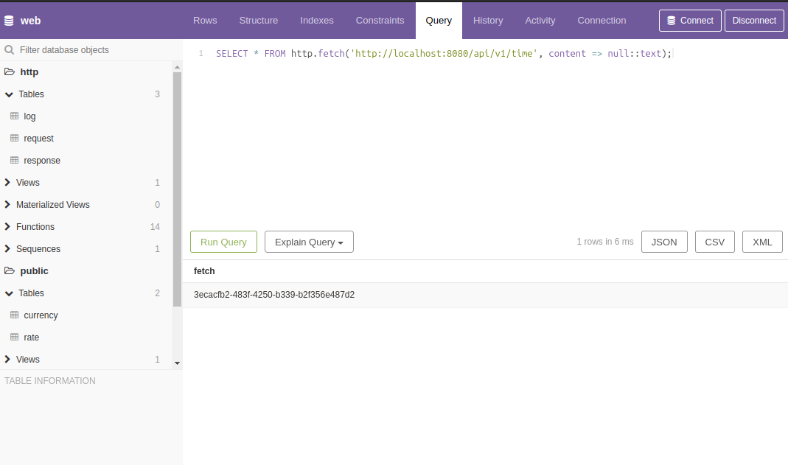
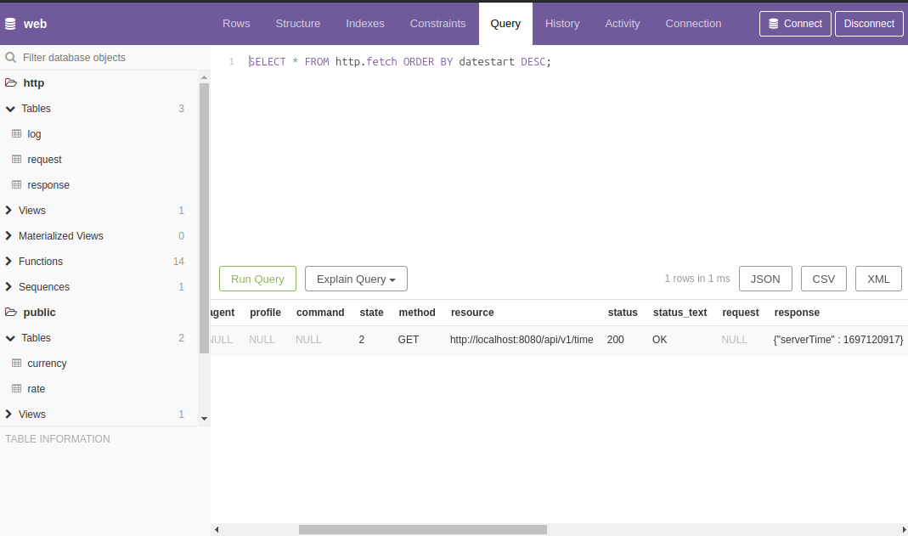
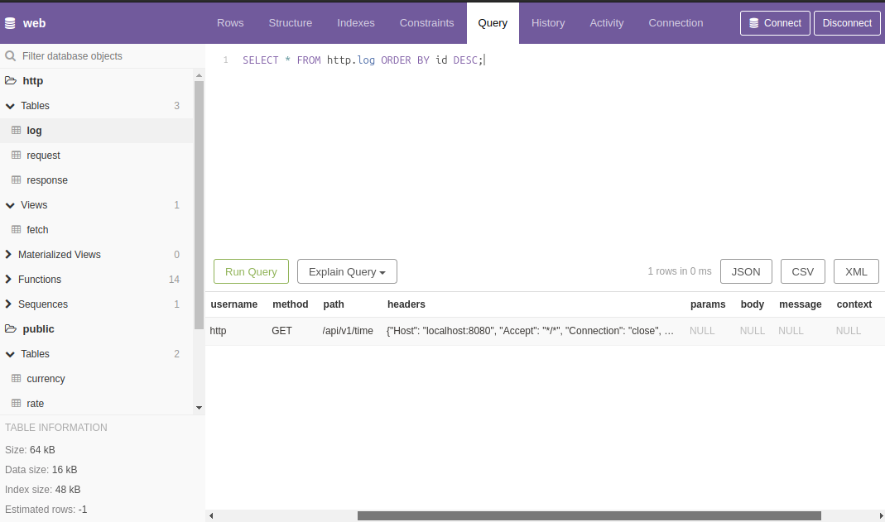
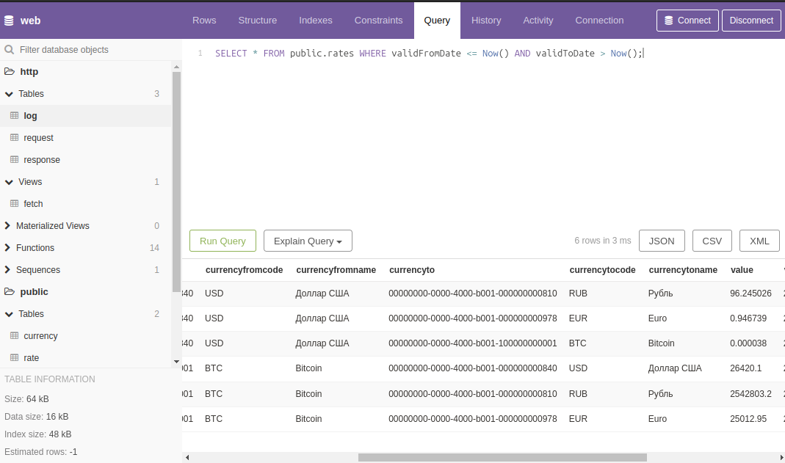
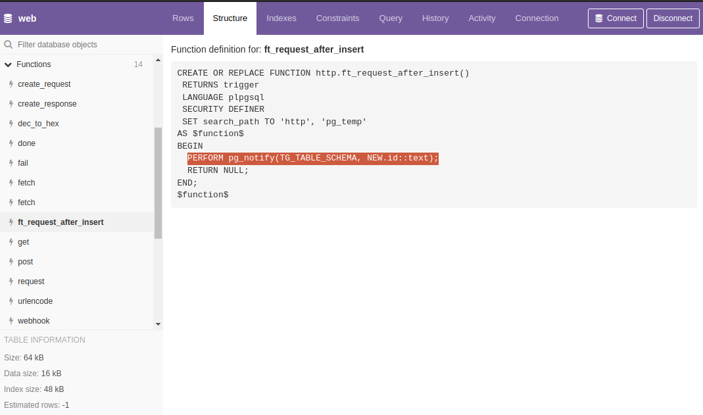
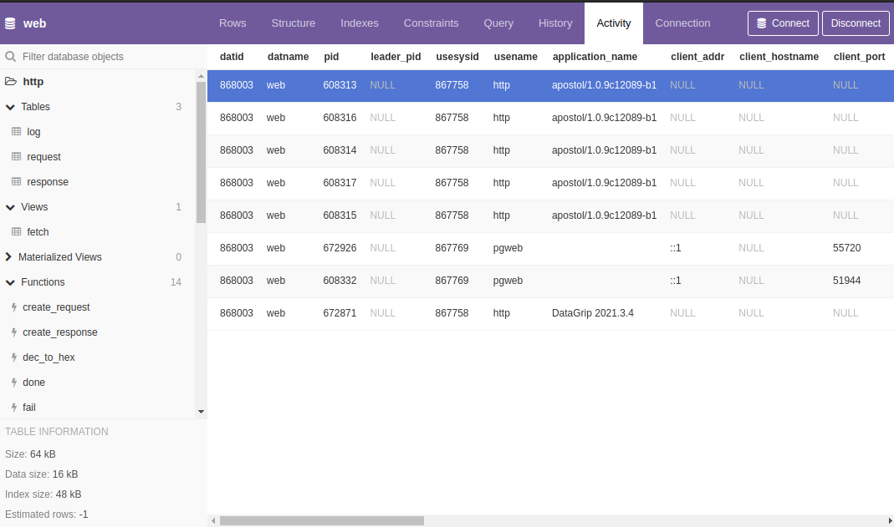

Отправка и обработка HTTP запросов в PostgreSQL
=

В этой статье я хочу поделиться некоторыми наработками, которые мы используем в своих проектах, в частности, тем, как отправлять и обрабатывать HTTP-запросы непосредственно из/в PostgreSQL.

> Сразу оговорюсь, Вам не придется устанавливать в базу данных дополнительные расширения и вызывать функции, написанные на отличном от [PL/pgSQL](https://postgrespro.ru/docs/postgresql/16/plpgsql) языке программирования. Более того, все запросы будут выполняться асинхронно, а обработка полученных данных будет происходить через функции обратного вызова.

Pgweb
-

Для демонстрации понадобится предварительно настроенная база данных, доступ к которой можно получить или на нашем сайте по адресу <https://apostoldevel.com/pgweb>, или локально, запустив **Docker** контейнер.

> При переходе по [ссылке](https://apostoldevel.com/pgweb) откроется [pgweb](https://github.com/sosedoff/pgweb) - веб-обозреватель для PostgreSQL. В pgweb можно выполнять SQL-запросы, которые будут приведены ниже, а также ознакомиться с содержимым таблиц и программным кодом функций, написанных на [PL/pgSQL](https://postgrespro.ru/docs/postgresql/16/plpgsql).

Docker
-

Скачиваем образ Docker:
~~~shell
docker pull apostoldevel/apostol
~~~

Запускаем:
~~~shell
docker run -p 8080:8080 -p 8081:8081 -p 5433:5432 --name apostol apostoldevel/apostol
~~~

Ждём, когда контейнер загрузится, и открываем pgweb по ссылке <http://localhost:8081> в браузере.

Теперь у нас есть всё необходимое для того, чтобы выполнить HTTP-запрос непосредственно из PostgreSQL.

> Вместо pgweb можно использовать любой другой инструмент для работы с базами данных. PostgreSQL из контейнера будет доступен на порту 5433.

HTTP клиент
-

В качестве первого примера выполним HTTP-запрос к самому себе (внутри локального хоста):

~~~sql
SELECT http.fetch('http://localhost:8080/api/v1/time', content => null::text);
~~~

Выполнение HTTP-запроса будет происходить **асинхронно**, поэтому в ответ мы получим не данные HTTP-запроса, а `uuid` идентификатор.

Исходящие HTTP-запросы будут записаны в таблицу `http.request`, а результат выполнения HTTP-запроса будет сохранён в таблице `http.response`.

Для просмотра исходящих HTTP-запросов и полученных на них ответов воспользуемся представлением `http.fetch`:

~~~sql
SELECT * FROM http.fetch ORDER BY datestart DESC;
~~~

В поле `status` будет код HTTP-ответа ([HTTP response status codes](https://developer.mozilla.org/en-US/docs/Web/HTTP/Status)) на наш HTTP-запрос, а в поле `response` - ответ.

В качестве следующего примера запросим данные с [JSONPlaceholder](https://jsonplaceholder.typicode.com):

~~~sql
SELECT http.fetch('https://jsonplaceholder.typicode.com/posts/1', 'GET', content => null::text, type => 'curl');
~~~

И в поле `response` представления `http.fetch` обнаружим:
~~~json
{
  "userId": 1,
  "id": 1,
  "title": "delectus aut autem",
  "completed": false
}
~~~

> Здесь дополнительно указан тип `curl`, данный параметр необходим для запросов к серверам, которые поддерживают только **HTTP/2** протокол (выполнение таких запросов происходит через библиотеку [cURL](https://curl.se)).

HTTP сервер
-

Входящие HTTP-запросы фиксируются в таблице `http.log`:

~~~sql
SELECT * FROM http.log ORDER BY id DESC;
~~~

Для обработки входящих HTTP-запросов в нашем распоряжении есть две PL/pgSQL функции `http.get` и `http.post`.

В качестве входящих параметров они принимают:

* `path` - Путь;
* `headers` - HTTP заголовки;
* `params` - Строка запроса (query string), преобразованная в формат JSON;
* `body` - Тело запроса, если это POST запрос.

В качестве ответа функции возвращают множество ([SETOF](https://postgrespro.ru/docs/postgresql/16/xfunc-sql)) json строк.

> Возвращаемое значение в виде множества позволяет нам более эффективно работать с данными, обрабатывая каждую строку в отдельности. [Подробнее тут](https://postgrespro.ru/docs/postgresql/16/plpgsql-control-structures).

Пример кода из `http.get`:
~~~sql
 WHEN 'log' THEN
 
    FOR r IN SELECT * FROM http.log ORDER BY id DESC
    LOOP
      RETURN NEXT row_to_json(r);
    END LOOP;
~~~

Задействовать приведённый выше код можно так:
~~~sql
SELECT http.fetch('http://localhost:8080/api/v1/log', content => null::text);
~~~

Функции обратного вызова
-

В начале статьи я упомянул, что обработка полученных данных будет происходить через функции обратного вызова.

Для лучшего понимания того, как это будет происходить, давайте решим конкретную задачу, например, получение курсов валют с разбором полученного ответа и сохранением данных в таблицу курсов.

Чтобы было понятно, как это работает в связке с HTTP-сервером, я добавил в функцию `http.get` следующий код:
~~~sql
  WHEN 'latest' THEN

    FOR r IN SELECT * FROM jsonb_to_record(params) AS x(base text, symbols text)
    LOOP
      IF r.base = 'USD' THEN
        RETURN NEXT jsonb_build_object('success', true, 'timestamp', trunc(extract(EPOCH FROM Now())), 'base', r.base, 'date', to_char(Now(), 'YYYY-MM-DD'), 'rates', jsonb_build_object('RUB', 96.245026, 'EUR', 0.946739, 'BTC', 0.000038));
      ELSIF r.base = 'BTC' THEN
        RETURN NEXT jsonb_build_object('success', true, 'timestamp', trunc(extract(EPOCH FROM Now())), 'base', r.base, 'date', to_char(Now(), 'YYYY-MM-DD'), 'rates', jsonb_build_object('RUB', 2542803.2, 'EUR', 25012.95, 'USD', 26420.1));
      ELSE
        RETURN NEXT jsonb_build_object('success', false, jsonb_build_object('code', 400, 'message', format('Base "%s" not supported.', r.base)));
      END IF;
    END LOOP;
~~~

> На запрос «самых последних» (latest) курсов мы будем возвращать статические данные в формате [API курсов валют](https://exchangeratesapi.io/documentation). Если у Вас есть доступ к службам курсов валют, Вы можете запросить данные через их API.

Обрабатывать полученные данные мы будем с помощью функции обратного вызова `public.exchange_rate_done`, с программным кодом которой можно ознакомиться в pgweb, а сами запросы будут следующими:

Из контейнера:
~~~sql
SELECT http.fetch('http://localhost:8080/api/v1/latest?base=USD', 'GET', null, null, 'public.exchange_rate_done', 'public.exchange_rate_fail', 'api.exchangerate.host', null, 'latest');
SELECT http.fetch('http://localhost:8080/api/v1/latest?base=BTC', 'GET', null, null, 'public.exchange_rate_done', 'public.exchange_rate_fail', 'api.exchangerate.host', null, 'latest');
~~~

Через наш сервер:
~~~sql
SELECT http.fetch('https://apostoldevel.com/api/v1/latest?base=USD', 'GET', null, null, 'public.exchange_rate_done', 'public.exchange_rate_fail', 'api.exchangerate.host', null, 'latest');
SELECT http.fetch('https://apostoldevel.com/api/v1/latest?base=BTC', 'GET', null, null, 'public.exchange_rate_done', 'public.exchange_rate_fail', 'api.exchangerate.host', null, 'latest');
~~~

Через службу курсов валют (при наличии доступа):
~~~sql
SELECT http.fetch('https://api.exchangerate.host/latest?base=USD&symbols=BTC,EUR,RUB', 'GET', null, null, 'public.exchange_rate_done', 'public.exchange_rate_fail', 'api.exchangerate.host', null, 'latest', null, 'curl');
SELECT http.fetch('https://api.exchangerate.host/latest?base=BTC&symbols=USD,EUR,RUB', 'GET', null, null, 'public.exchange_rate_done', 'public.exchange_rate_fail', 'api.exchangerate.host', null, 'latest', null, 'curl');
~~~

Результатом этих действий станет заполненная данными таблица `public.rate`.

Посмотреть актуальные на данный момент курсы можно через представление `public.rates`:
~~~sql
SELECT * FROM public.rates WHERE validFromDate <= Now() AND validToDate > Now();
~~~

Асинхронное уведомление
-

Прежде чем подробно разобрать, как же это всё работает, обратимся к [документации](https://postgrespro.ru/docs/postgresql/16/libpq-notify) PostgreSQL:

> **34.9. Асинхронное уведомление**
>
> PostgreSQL предлагает асинхронное уведомление посредством команд `LISTEN` и `NOTIFY`. Клиентский сеанс работы регистрирует свою заинтересованность в конкретном канале уведомлений с помощью команды `LISTEN` (и может остановить прослушивание с помощью команды `UNLISTEN`). Все сеансы, прослушивающие конкретный канал, будут уведомляться в асинхронном режиме, когда в рамках любого сеанса команда `NOTIFY` выполняется с параметром, указывающим имя этого канала. Для передачи дополнительных данных прослушивающим сеансам может использоваться строка `payload`.

Как Вы уже, наверное, догадались, именно этот механизм лежит в основе взаимодействия PostgreSQL с неким клиентским приложением, но не будем забегать вперёд.

Подробно
-

Рассмотрим более подробно, что происходит на стороне PostgreSQL после вызова функции `http.fetch`:

PL/pgSQL функция `http.fetch` является оберткой для функции `http.create_request`, в которой происходит запись в таблицу `http.request` с последующим вызовом команды `NOTIFY` через триггер добавления новой записи. На этом, собственно, всё.

Далее в ход вступает некое клиентское приложение, которое подключено к PostgreSQL и готово принимать асинхронные уведомления, и именно оно выступает в качестве HTTP-клиента и сервера, отправляет HTTP-запрос и сохраняет результат в таблицу `http.response`.

Клиентское приложение
-

Клиентское приложение — отдельная программа, в задачу которой входит по сигналу от сервера выполнять те или иные действия, в данном случае выполнять HTTP-запросы на основе тех данных, которые содержатся в таблице `http.request`.

Если Вы или Ваша команда достаточно опытны, то разработать подобное приложение не должно составить труда. Мы же используем свою собственную **open source** разработку — [Апостол](https://github.com/apostoldevel/apostol).

Заключение
-

Я продемонстрировал простой в использовании, но в то же время очень гибкий механизм коммуникации с внешними системами непосредственно из PostgreSQL.

Если говорить о практическом применении, то представьте, что в вашей системе формируется счёт на оплату, по которому должно произойти автоматическое списание денег с заранее привязанной карты клиента. Все необходимые данные для реализации этой задачи находятся в базе данных. Следовательно, то приложение (микросервис), которое будет взаимодействовать с платежной системой, должно быть подключено к базе данных и каким-то образом оповещено о наличии нового счета. Приложение должно получить необходимые данные, обработать их, сформировать запрос к платежной системе, сохранить результат в БД. После успешного списания необходимо сформировать электронный чек, а это уже взаимодействие с другим сервисом, а ещё было бы неплохо уведомить клиента по e-mail, в виде СМС или через мобильное приложение ([FCM](https://firebase.google.com/docs/cloud-messaging?hl=ru)) о наличии счёта и статусе выполнения операции.

Иными словами, мы получаем каскад задач на взаимодействие с внешними системами через их API, при этом оперируя теми данными, которые находятся в СУБД.

Так если данные в СУБД и у нас есть механизм коммуникации с внешними системами из PostgreSQL, то почему бы не формировать запросы к API внешних систем в той же среде, где и данные? Вопрос риторический.

Приведённый выше пример не из разряда теоретических выкладок, а вполне практическая и рабочая реализация.

Если нужен более наглядный пример, то вот: [Talking to AI](https://t.me/TalkingToAIBot) это чат-бот в Telegram для общения с искусственным интеллектом (ChatGPT), который реализован на PL/pgSQL.

Есть пример Telegram бота на PL/pgSQL с исходным кодом, ссылка ниже.

Ссылки на исходные коды:
* [Апостол](https://github.com/apostoldevel/apostol)
* [Postgres Fetch](https://github.com/apostoldevel/module-PGFetch)
* [Telegram bot in Postgres](https://github.com/apostoldevel/apostol-pgtg)